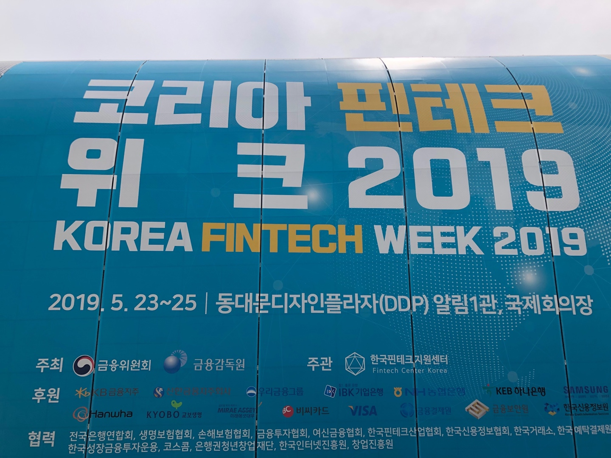

5/25  코리아 핀테크 위크 2019

5월 25일 동대문디자인플라자 DDP에서 열린 코리아 핀테크 위크 2019에 참가했다. 글로벌 핀테크 트렌드와 한국 핀테크 산업의 현재와 미래를 경험할 수 있도록 다양한 체험 박람회가 진행되고 있었다. 정말 많은 금융권이 참가했고 신기할 정도로 기술들은 발전되고 있었다. 처음에 들어가면 스마트폰 AI키오스크가 있었고 지도 안내, 이벤트, 주요행사에대해 음성으로 말을 걸면 친절하게 대답해주었다.  대부분의 부스는 QR코드로 이루어진 행사가 진행되었다. 삼성페이, 카카오페이, 뱅크샐러드, 신한 Face Pay, BC 페이북, 우리금융그룹 등 다양한 금융권들이 있었다. 신한은 Face Pay로 3D·적외선 카메라로 추출한 디지털 얼굴 정보와 결제정보를 매칭해 매장에서 안면인식만으로 결제하는 방식을 선보였다. 최근 얼굴인식이 대두되고 있는 시점에서 트렌드를 잘 따른 것 같다. 빅밸류는 비접촉 지문과 장문인식 모바일 인증으로 카메라를 이용하여 지문과 손바닥을 촬영하고 인식하는 바이오 인증 솔루션을 선보였다. 지문을 인식하여 공인인증서를 대체한다는 점에서 편리성이 느껴졌고, 이 기술 도입을 시도한 은행과 증권이 늘어나고 있다 했다. 투자성향, 소비 습관 분석 등 다양한 종류의 기술들이 금융권에 도입되어 있었다. 내가 평소에 사용하는 뱅크샐러드 부스가 있어서 반가웠다. 데이터를 금융으로 바꿔주는 뱅크샐러드는 국내 1위 돈 관리 서비스로 고객의 눈높이를 맞춰 최적의 금융 솔루션을 제공한다는 점에서 인기를 얻고있다. 페이앱은 오프라인에서 온라인으로 사업을 확장하고 싶은 사람들을 위한 서비스를 제공했다. 카드단말기를 돈으로 사는 것이 아니라 앱만 설치하면 스마트폰을 카드 단말기로 쓸 수 있어서 써보고 싶어지는 마음이 들었다. 특히 카드, 링크, 수기, QR코드, 삼성페이 등 모든 결제 방식을 지원한다고 하니 많은 점주들의 마음을 사로잡을 수 있는 앱이라고 생각한다. 다양한 행사가 진행되고 있었고 이렇게 금융과 기술이 결합된 행사를 참여할 수 있어서 색달랐고 재밌었다. 또한 금융권으로 취업을 하고 싶다는 생각도 들었던 좋은 기회가 되었다. 
